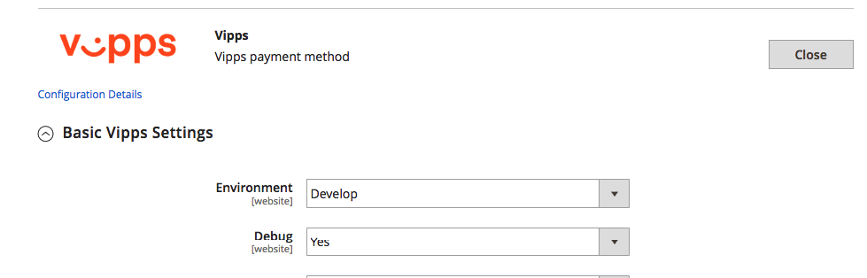
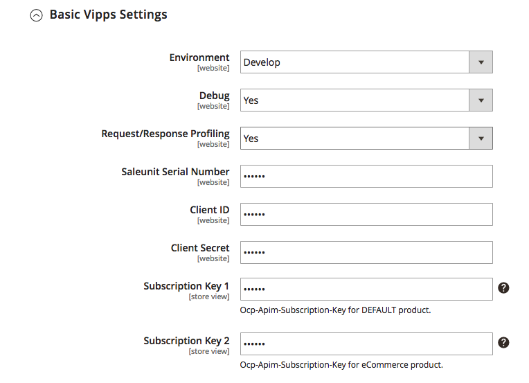

# Vipps Payment Module for Magento 1: Installation

# Prerequisites

1. [Magento 1.7+](https://devdocs.magento.com/guides/m1x/install/installing_install.html)
1. SSL must be installed on your site and active on your Checkout pages.
1. You must have a Vipps merchant account. See [Vipps på Nett](https://www.vipps.no/bedrift/vipps-pa-nett)
1. As with _all_ Magento extensions, it is highly recommended to backup your site before installation and to install and test on a staging environment prior to production deployments.

# Manual Installation

Here are steps required to install Payments extension manually.

1. Clone extension from Github. `git clone git@github.com:vippsas/vipps-magento-v1.git`
1. Copy recursively extension directories (app, skin) to Magento root directory. `cp -r vipps_payment/{app,skin} $magentoRoot/`
1. Clear Magento cache.

# Configuration

The Vipps Payment module can be easily configured to meet business expectations of your web store. This section will show you how to configure the extension via `Magento Admin`.

From Magento Admin navigate to `System` -> `Configuration` -> `Sales` -> `Payment Methods` section. On the Payments Methods page the Vipps Payments method should be listed together with other installed payment methods in a system.

## Add a separate connection for Vipps resources
* Duplicate 'default' connection in app/etc/local.xml and name it 'vipps'. It should look like:
```         
            <vipps>
                <connection>
                    <host><![CDATA[localhost]]></host>
                    <username><![CDATA[root]]></username>
                    <password><![CDATA[KalaMaja987]]></password>
                    <dbname><![CDATA[magento1]]></dbname>
                    <initStatements><![CDATA[SET NAMES utf8]]></initStatements>
                    <model><![CDATA[mysql4]]></model>
                    <type><![CDATA[pdo_mysql]]></type>
                    <pdoType/>
                    <active>1</active>
                </connection>
            </vipps>
```

These settings are required to prevent profiles loss when Magento reverts invoice/refund transactions.

# Settings

Vipps Payments configuration is divided by sections. It helps to quickly find and manage settings of each module feature:

1. Basic Vipps Settings.
1. Express Checkout Settings.



Please ensure you check all configuration settings prior to using Vipps Payment. Pay attention to the Vipps Basic Settings section, namely `Saleunit Serial Number`, `Client ID`, `Client Secret`, `Subscription Key 1`, `Subscription Key 2`.

For information about how to find the above values, see the [Vipps Developer Portal documentation](https://github.com/vippsas/vipps-developers/blob/master/vipps-developer-portal-getting-started.md).

# Basic Vipps Settings



# Express Checkout Settings


# Support

Magento is an open source ecommerce solution: https://magento.com

Magento Inc is an Adobe company: https://magento.com/about

For Magento support, see Magento Help Center: https://support.magento.com/hc/en-us

Vipps has a dedicated team ready to help: magento@vipps.no
